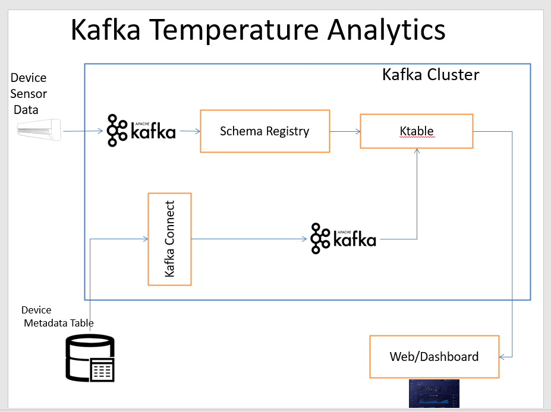

# Kafka Temperature Analytics
Kafka Streams app to process streaming events from sensors


## Prerequisite
1. [Java 11](https://www.azul.com/downloads/?version=java-11-lts&package=jdk)
2. [Docker](https://www.docker.com/)   
3. [Confluent Kafka 6.2.0](https://docs.confluent.io/platform/current/quickstart/ce-docker-quickstart.html)
4. [Maven](https://maven.apache.org/)
## Getting Started
To run the application,
Change PropertyFiles **application.properties**  and **equipment.properties** accordingly

Build the maven project

```
mvn clean install  
```

## Run the project
Follow the steps to get output

Produce data in avro format using [Datagen](https://github.com/appuv/KafkaDataGen) to the topics.
For Dashboard run the [Live Dashboard](https://github.com/appuv/Live-Dashboard-using-Kafka-and-Spring-Websocket)

To Change Capture
```
java -cp KafkaTemperatureAnalytics-0.1.jar com.appu.main.EquipmentAvroToJson
java -cp KafkaTemperatureAnalytics-0.1.jar com.appu.main.EquipmentAnalytics
```

## Demo Link
[Youtube Link](https://youtu.be/Cj3BeA4bV1c)

[Medium](https://medium.com/@masterappu/realtime-temperature-analytics-using-kafka-b1db9d91b870)


